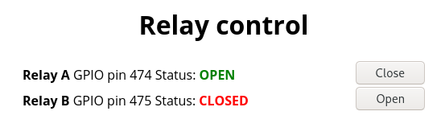

# Relay control
Simple program for switching relays via GPIO on Linux with FastCGI HTTP-based API and web interface.



#### Installation
- Install GNU C99-compliant compiler (`gcc` or `clang`) and FastCGI library with development headers (`libfcgi-dev` package in Debian)
- Edit `src/relay-conrol.h`
- Run `make install`
- Install any HTTP server with FastCGI support. I am using `lighttpd`. There is a part of possible content in `/etc/lighttpd/lighttpd.conf`:

```
...
server.document-root = "/var/www/html"
server.username = "www-data"
server.groupname = "www-data"
...
server.modules = (
	...
        "mod_fastcgi",
	"mod_staticfile"
)
...
fastcgi.server = (
  "/relay" => ((
    "socket" => "/run/relay-control.sock",
    "check-local" => "disable"
  ))
)
```

- Run `make install`
- Add `/usr/local/bin/relay-control` to autostart. If you are using `systemd` simply copy `relay-control.service` to `/etc/systemd/system` and run `systemctl enable --now relay-control`.

#### API

- To get relay info in CSV format request `/relay?status=csv`. Typical response:
```
relay,active,name
474,0,Relay A
475,0,Relay B
```
- To set LOW or HIGH relay GPIO pin request: `/relay?<"off" for LOW, "on" for HIGH>=<pin id>`. Response on success:

Example request: `/relay?on=475`. Response: `Successfully set HIGH level on relay!`.
